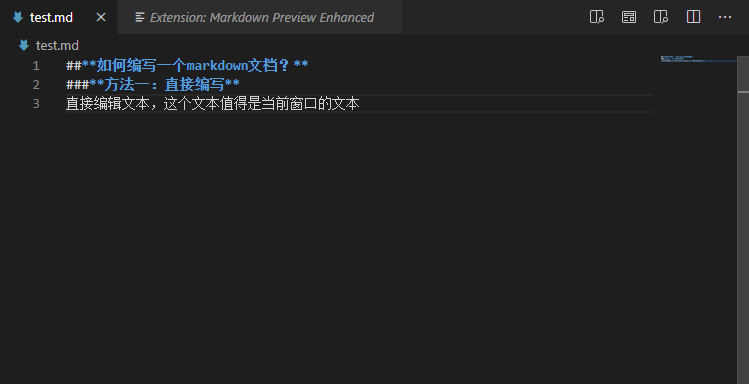
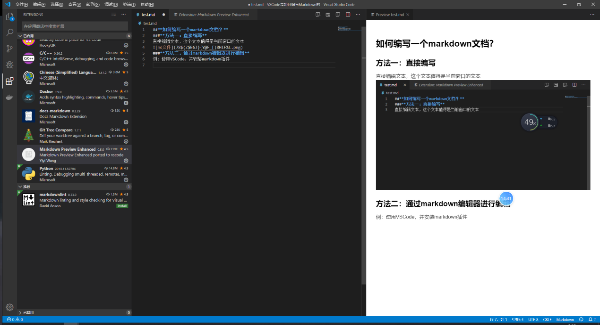
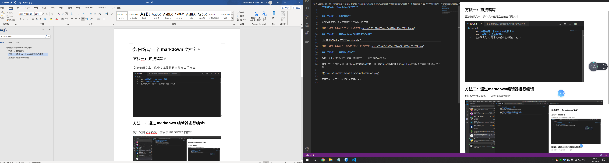

**如何编写一个markdown文档？**
------------------------------

### **方法一：直接编写**

直接编辑文本，这个文本值得是当前窗口的文本

### **方法二：通过markdown编辑器进行编辑**

例：使用VSCode，并安装markdown插件

### **方法三：通过Word转化**

新建一个docx文档，进行编辑，编辑好之后，我们另存为md文件。

但是，有一个前提条件：你的Word支持生成md文档。那么你的Word如何才能生成Markdown文档呢？这里我们提供两个软件：

安装方法，双击之后，按提示安装即可。

